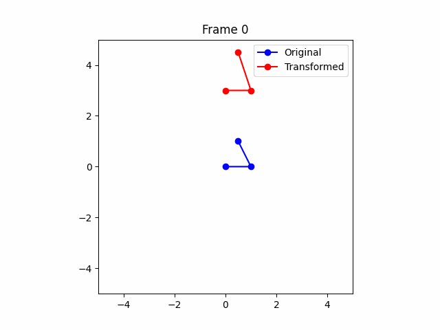
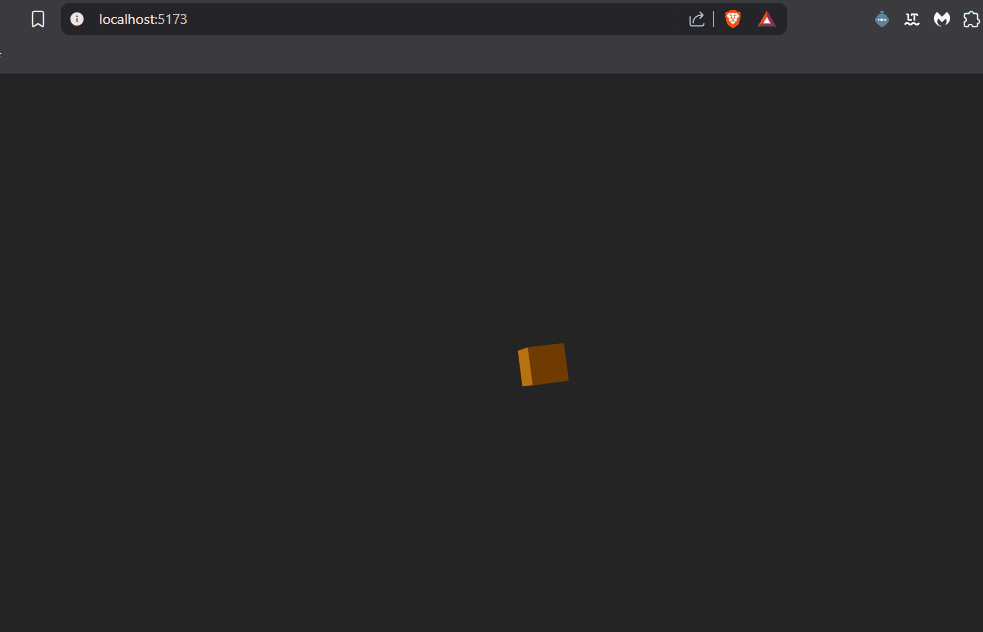
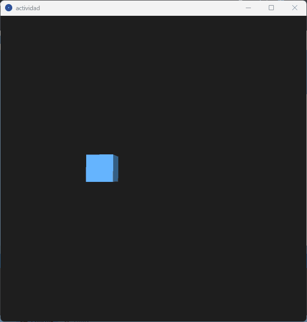

# 🧪 Transformaciones y Animación 2D/3D

📅 Fecha  
2025-04-15 – Fecha 

---

🎯 Objetivo del Taller  
Explorar el uso de transformaciones geométricas (traslación, rotación y escala) aplicadas a figuras 2D y 3D mediante diferentes entornos de programación. Se pretende construir animaciones dinámicas usando matrices o herramientas específicas del entorno.

---

🧠 Conceptos Aprendidos

- ✅ Transformaciones geométricas (escala, rotación, traslación)
- Otro: Uso de frameworks gráficos 2D/3D (Matplotlib, Three.js, Processing)

---

🔧 Herramientas y Entornos

- Python (numpy, matplotlib, imageio)
- Three.js / React Three Fiber
- Processing (modo P3D)

vas guías oficiales.

---

📁 Estructura del Proyecto


2025-04-15_taller1_transformaciones/<br> ├── python/ # Código en Python + transformación y GIF generado<br> │ ├── actividad.py<br> │ └── transformacion.gif<br> ├── threejs/ # Componente React con animación en 3D<br> │ ├── src/<br> │ │ ├── Experience.jsx<br> │ │ ├── App.jsx<br> │ │ ├── Index.css<br> │ │ └── main.jsx<br> │ └── public/images/Animation.gif<br> ├── processing/ # Sketch en Processing<br> │ ├── actividad.pde<br> │ └── images/Animation.gif<br> ├── README.md


---

🧪 Implementación

🔹 Etapas realizadas

1. Preparación del entorno en cada plataforma (Python, React Three Fiber, Processing).
2. Construcción de geometría base (triángulo en 2D o cubo en 3D).
3. Aplicación de transformaciones geométricas: traslación, rotación y escalado.
4. Visualización dinámica con animación basada en tiempo.
5. Exportación del resultado (GIF animado).

🔹 Código relevante

**Python - Matriz de transformación homogénea:**

```python
def translate(points, tx, ty):
    T = np.array([
        [1, 0, tx],
        [0, 1, ty],
        [0, 0, 1]
    ])
    return T @ points
```

**Three.js - Movimiento circular y escalado suave:**

```jsx
useFrame(({ clock }) => {
  const t = clock.getElapsedTime()
  mesh.position.x = Math.cos(t) * 2
  mesh.position.z = Math.sin(t) * 2
  const scale = 1 + 0.3 * Math.sin(t * 2)
  mesh.scale.set(scale, scale, scale)
})
```

**Processing - Transformaciones 3D en tiempo real:**

```java
pushMatrix();
translate(x, y, 0);
rotateX(rot);
rotateY(rot);
scale(s);
box(100);
popMatrix();
```

---

📊 Resultados Visuales

✅ Este taller requiere explícitamente un GIF animado. A continuación, se incluyen los generados por cada entorno:

### Python  


### Three.js  


### Processing  


---

🧩 Prompts Usados

- "Crea una animación en Python que transforme un triángulo con rotación, escala y traslación usando matrices homogéneas."
- "Genera un cubo 3D en Three.js con movimiento circular, rotación continua y escalado oscilante en tiempo real con React Three Fiber."
- "Diseña una animación en Processing donde un cubo se mueva en círculo, rote y cambie de tamaño suavemente con base en el tiempo transcurrido."


---

💬 Reflexión Final  

Este taller fue clave para reforzar el entendimiento de las transformaciones geométricas aplicadas en tiempo real, tanto en entornos 2D como 3D. Fue interesante ver cómo los mismos conceptos matemáticos pueden trasladarse entre diferentes plataformas visuales y herramientas.

La parte más desafiante fue integrar la lógica de transformación con la animación continua en cada entorno, especialmente ajustando parámetros para que los movimientos fueran suaves y visualmente atractivos. En el futuro, me gustaría combinar estas transformaciones con detección de gestos o interacciones en tiempo real, como control por voz o cámara.
