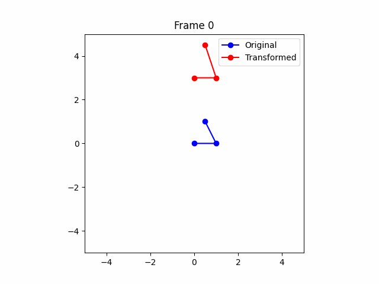
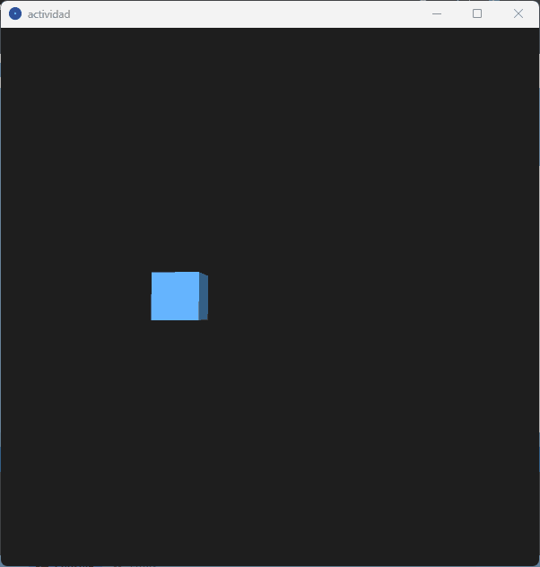

# Transformaciones y Animación 2D/3D

Este repositorio contiene tres implementaciones diferentes de animaciones y transformaciones geométricas utilizando distintos entornos y herramientas:

- Python con Matplotlib y Numpy
- React Three Fiber (Three.js + React)
- Processing (2D/3D)

Cada implementación muestra cómo aplicar traslación, rotación y escala en una figura geométrica con animaciones dinámicas en función del tiempo.

---

## 🐍 Python (Matplotlib + Numpy + ImageIO)

**Archivo:** `actividad.py`

Esta implementación utiliza matrices de transformación (traslación, rotación y escala) para modificar un triángulo en un plano 2D. Se genera una animación cuadro por cuadro usando `matplotlib` y se exporta como un GIF con `imageio`.

### Características:

- Transformaciones usando álgebra matricial 3x3 (homogénea)
- Visualización del triángulo original vs. transformado
- Animación basada en `sin()` y `cos()` para movimiento y escalado
- Exportación a GIF sin guardar archivos temporales
- Se imprime por consola la matriz resultante de cada transformación por frame

### GIFT

---

## 🌐 Three.js con React Three Fiber

**Archivo:** `Experience.jsx`

Esta versión renderiza un cubo en un entorno 3D usando React y Three.js (con React Three Fiber). La animación es controlada por `useFrame` y actualiza cada frame en base al tiempo transcurrido.

### Características:

- Movimiento circular del cubo (trayectoria senoidal)
- Rotación continua sobre los ejes X e Y
- Escalado suave y cíclico usando `Math.sin`
- Preparado para usar con `Canvas` y `OrbitControls` de `@react-three/drei`

### GIFT

---

## 🎨 Processing (P3D)

**Archivo:** `actividad.pde`

Un sketch en 3D que anima un cubo con transformaciones en tiempo real. El cubo se traslada en una trayectoria circular, rota continuamente y se escala de forma cíclica.

### Características:

- Uso de `translate()`, `rotateX()`, `rotateY()`, `scale()` para transformar
- Animaciones en función del tiempo (`millis()`)
- Movimiento fluido en el espacio 3D
- Código simple que usa `pushMatrix()` y `popMatrix()` para aislar transformaciones

### GIFT

---

## 💡 Objetivo Común

Las tres versiones buscan ilustrar los conceptos fundamentales de las **transformaciones geométricas animadas** (traslación, rotación, escala) en diferentes entornos gráficos, demostrando cómo pueden implementarse desde cero con matrices o con herramientas específicas del framework.

---

## 🚀 Requisitos

- Python 3.8+ (con `numpy`, `matplotlib`, `imageio`)
- Node.js + Vite + React para la versión Three.js
- Processing 4.0+ para la versión en Java

---

## 📂 Estructura del repositorio

2025-04-15_taller1_transformaciones/ 
├── python/ 
├── threejs/ 
├── processing/ 
├── README.md 

---------------------------------------------------------------

# 2D/3D Transformations and Animation

This repository contains three different implementations of geometric animations and transformations using different environments and tools:

- Python with Matplotlib and Numpy
- React Three Fiber (Three.js + React)
- Processing (2D/3D)

Each implementation shows how to apply translation, rotation, and scaling to a geometric figure with dynamic animations based on time.

---

## 🐍 Python (Matplotlib + Numpy + ImageIO)

**File:** `activity.py`

This implementation uses transformation matrices (translation, rotation, and scaling) to modify a triangle on a 2D plane. A frame-by-frame animation is generated using `matplotlib` and exported as a GIF with `imageio`.

### Features:

- Transformations using 3x3 (homogeneous) matrix algebra
- Visualization of the original triangle vs. transformed
- Animation based on `sin()` and `cos()` for movement and scaling
- Export to GIF without saving temporary files
- The resulting matrix of each transformation is printed to the console per frame

---

## 🌐 Three.js with React Three Fiber

**File:** `Experience.jsx`

This version renders a cube in a 3D environment using React and Three.js (with React Three Fiber). The animation is controlled by `useFrame` and updates each frame based on the elapsed time.

### Features:

- Circular motion of the cube (sinusoidal path)
- Continuous rotation along the X and Y axes
- Smooth, cyclic scaling using `Math.sin`
- Ready for use with `Canvas` and `OrbitControls` from `@react-three/drei`

---

## 🎨 Processing (P3D)

**File:** `activity.pde`

A 3D sketch that animates a cube with real-time transformations. The cube moves in a circular path, continuously rotates, and scales cyclically.

### Features:

- Use of `translate()`, `rotateX()`, `rotateY()`, `scale()` to transform
- Time-based animations (`millis()`)
- Fluid motion in 3D space
- Simple code using `pushMatrix()` and `popMatrix()` to isolate transformations

---

## 💡 Common Goal

All three versions aim to illustrate the fundamental concepts of **animated geometric transformations** (translation, rotation, scale) in different graphical environments, demonstrating how they can be implemented from scratch with matrices or with framework-specific tools.

---

## 🚀 Requirements

- Python 3.8+ (with `numpy`, `matplotlib`, `imageio`)
- Node.js + Vite + React for the Three.js version
- Processing 4.0+ for the Java version

---

## 📂 Repository Structure

2025-04-15_taller1_transformaciones/ 
├── python/ 
├── threejs/ 
├── processing/ 
├── README.md 

