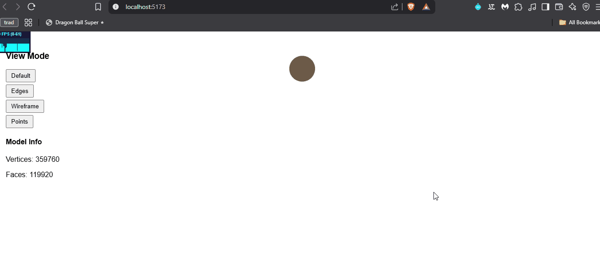

# 🧪 Visualización y Análisis de Modelos 3D

📅 Fecha  
2025-04-21 – Fecha de entrega

---

🎯 Objetivo del Taller  
Explorar el manejo, visualización y análisis de modelos 3D en diferentes entornos de programación. Se trabajan herramientas de renderizado, estructuras de malla y animaciones aplicadas a modelos en formatos como `.OBJ`, `.STL` o `.GLTF`.

---

🧠 Conceptos Aprendidos

✅ Lectura y manipulación de mallas 3D (vértices, caras, aristas).

✅ Uso de herramientas como trimesh, vedo y React Three Fiber para cargar y visualizar modelos.

✅ Generación de animaciones 3D y exportación a GIF.

✅ Implementación de interfaces para cambiar visualizaciones (vértices, aristas, caras) de manera interactiva.

Bonus: Renderizado en tiempo real y control de cámara.

---

🔧 Herramientas y Entornos

- Python: `trimesh`, `vedo`, `numpy`, `matplotlib`
- React Three Fiber (Three.js), @react-three/drei
- Vite como entorno base para el proyecto React

---

📁 Estructura del Proyecto

2025-04-25_taller3_visualizacion_3d/
├── python/
│   ├── estructuras_3d_python.ipynb
│   ├── animacion_malla.gif
│   └── models/
│       └── eyeball.obj
├── entorno/
│   └── threejs/
│       └── react-three-fiber-app/
│           ├── src/
│           │   ├── App.jsx
│           │   ├── App.css
│           │   └── main.jsx
│           ├── public/
│           │   └── datos/
│           │       └── candle.obj
│           └── images/
│               └── visualizacion_three.gif
└── README.md

---

🧪 Implementación

### 🧩 Python – Visualización y Análisis con Trimesh y Vedo

**Descripción:**  
Se carga un modelo `.obj` usando `trimesh`, se extrae su geometría y se visualiza con `vedo` usando distintos colores para vértices (rojo), aristas (verde) y caras (azul). Además, se genera una animación de rotación exportada como `.gif`.

**Código relevante:**
```python
vedo_mesh = vedo.Mesh([mesh.vertices, mesh.faces])
point_cloud = vedo.Points(mesh.vertices, r=8, c="red")
wireframe = vedo_mesh.wireframe().lw(2)
surface = vedo_mesh.clone().c("blue").alpha(0.7)
```


---

### 🎞️ Python – Animación de Malla 3D

**Descripción:**  
La animación rotacional de la malla 3D se genera usando `vedo`, girando progresivamente el modelo sobre el eje Z. El resultado se exporta como `.gif`.

**Código relevante:**
```python
def rotate():
    vedo_mesh.rotate_z(5)
    return vedo_mesh

vedo.io.Video("animacion_malla.gif").action(rotate, duration=10, rate=30)
```

**GIF de animación:**  


---

### 🌐 React Three Fiber – Visualización Interactiva

**Descripción:**  
Se desarrolla una aplicación React usando @react-three/fiber y @react-three/drei para cargar un modelo .obj (candle.obj). Se integra OrbitControls para navegación libre y una interfaz sencilla que permite alternar entre vistas de:

Caras coloreadas

Wireframe (aristas)

Bordes resaltados (Edges)

Puntos (vértices)
**Código relevante (JSX):**
```jsx
<mesh geometry={geometry}>
  {mode === 'faces' && <meshStandardMaterial color="lightblue" />}
  {mode === 'wireframe' && <meshBasicMaterial wireframe color="orange" />}
  {mode === 'edges' && (
    <>
      <meshStandardMaterial color="#d9bfa3" />
      <Edges threshold={15} color="red" />
    </>
  )}
  {mode === 'points' && (
    <points>
      <bufferGeometry attach="geometry" {...geometry} />
      <pointsMaterial color="red" size={0.01} />
    </points>
  )}
</mesh>
```

**GIF del visor interactivo:**  


---

🧩 Prompts Usados

- "Carga un modelo 3D `.obj` en Python y visualízalo usando `vedo` con colores distintos por tipo de componente."
- "Genera una animación rotando el modelo 3D cargado con `vedo` y exporta el resultado como `.gif`."
- "Crea una aplicación en React Three Fiber que cargue un `.obj`, permita orbitar la cámara y cambiar entre vista de caras, aristas y puntos."

---

💬 Reflexión Final  

Este taller fue clave para afianzar el proceso completo de carga, visualización y animación de modelos 3D.
Python resultó ideal para el análisis estructural y para crear animaciones rápidamente, mientras que React Three Fiber permitió una experiencia visual interactiva y más cercana a entornos web modernos.

Uno de los principales retos fue el manejo de formatos y la correcta conversión de datos entre librerías, especialmente en Python, y el control de visualización precisa de mallas en React. También fue necesario comprender bien conceptos como la geometría bufferizada (BufferGeometry) en Three.js y ajustar el renderizado de bordes y vértices.
