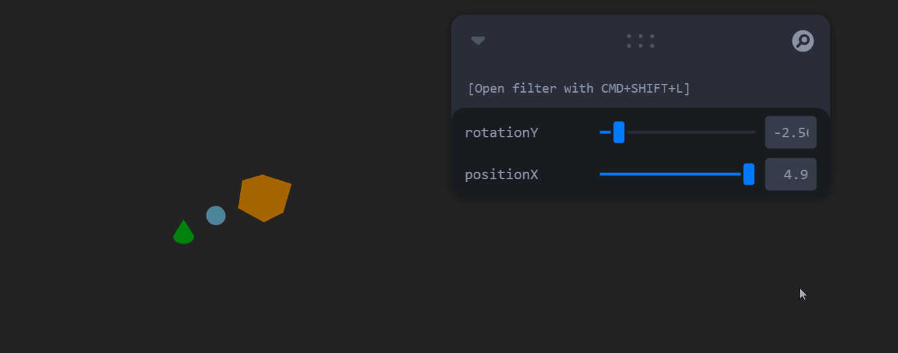

## 🧪 Jerarquías y Transformaciones: El Árbol del Movimiento
**📅 Fecha**

2025-04-21

**🎯 Objetivo del Taller**

Aplicar estructuras jerárquicas y árboles de transformación para organizar escenas en 3D y simular movimiento relativo entre objetos. El enfoque es entender cómo las transformaciones del nodo padre afectan automáticamente a los nodos hijos y nietos.

**🧠 Conceptos Aprendidos**
* ✅ Implementación de jerarquías de transformación (padre-hijo-nieto) en 3D.
* ✅ Uso de grupos (`<group>`) en React Three Fiber para manejar transformaciones conjuntas.
* ✅ Aplicación de controladores en tiempo real usando leva para modificar rotación y traslación.
* ✅ Observación del movimiento relativo y dependiente en estructuras jerárquicas.
* **Bonus:** Integración de un tercer nivel (nodo nieto) y visualización de transformaciones encadenadas.

**🔧 Herramientas y Entornos**

* React Three Fiber (`@react-three/fiber`, `three`)
* Vite como entorno base para el proyecto React
* Leva para control interactivo de parámetros

**📁 Estructura del Proyecto**

2025-04-25_taller3_visualizacion_3d/<br>
├── python/<br>
│   ├── estructuras_3d_python.ipynb<br>
│   ├── animacion_malla.gif<br>
│   └── models/<br>
│       └── eyeball.obj<br>
├── entorno/<br>
│   └── threejs/<br>
│       └── react-three-fiber-app/<br>
│           ├── src/<br>
│           │   ├── App.jsx<br>
│           │   ├── App.css<br>
│           │   └── main.jsx<br>
│           ├── public/<br>
│           │   └── datos/<br>
│           │       └── candle.obj<br>
│           └── images/<br>
│               └── visualizacion_three.gif<br>
└── README.md


**🧪 Implementación**

🔹 Etapas realizadas

1. Preparación de datos o escena.
2. Aplicación de modelo o algoritmo.
3. Visualización o interacción.
4.Guardado de resultados.


**🌐 React Three Fiber – Árbol de Movimiento 3D**

**Descripción:**

Se desarrolla una escena en React Three Fiber utilizando `<group>` para establecer una jerarquía entre un cubo (padre), una esfera (hijo) y un cono (nieto). La posición y rotación del nodo padre se controlan en tiempo real mediante sliders proporcionados por leva. Los nodos hijo y nieto siguen automáticamente las transformaciones del padre, respetando sus posiciones locales relativas.

**Código relevante (JSX):**
```jsx
// Tu código aquí
<group ref={parentRef}>
  <mesh position={[0, 0, 0]}>
    <boxGeometry args={[2, 2, 2]} />
    <meshStandardMaterial color="orange" />
  </mesh>

  <group ref={childRef} position={[4, 0, 0]}>
    <mesh>
      <sphereGeometry args={[0.5, 32, 32]} />
      <meshStandardMaterial color="skyblue" />
    </mesh>

    <group ref={grandchildRef} position={[2, 0, 0]}>
      <mesh>
        <coneGeometry args={[0.5, 1, 32]} />
        <meshStandardMaterial color="limegreen" />
      </mesh>
    </group>
  </group>
</group>
```


**GIF del visor interactivo:**  


🧩 Prompts Usados

"Crea una jerarquía de objetos 3D en React Three Fiber donde el movimiento del padre afecte a los hijos y nietos."
"Agrega controladores en tiempo real con leva para modificar la rotación y traslación de un grupo en React Three Fiber."


💬 Reflexión Final
Este taller fue fundamental para comprender la propagación de transformaciones dentro de estructuras jerárquicas en gráficos 3D.

Una de las principales dificultades fue entender cómo mantener las posiciones locales relativas de los nodos hijos al aplicar transformaciones al grupo padre. Además, integrar leva fue muy útil para ajustar valores de manera rápida sin tener que recompilar constantemente.
Descubrí la importancia de trabajar con referencias (ref) y useFrame para actualizar las transformaciones dinámicamente. Este conocimiento es esencial para construir animaciones y sistemas de movimiento más complejos en entornos 3D interactivos.

---