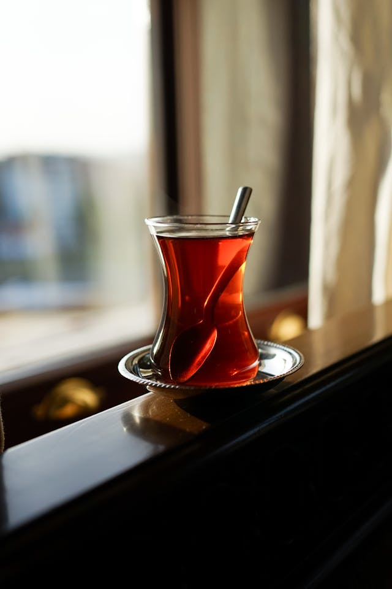
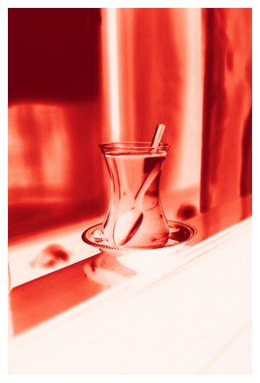
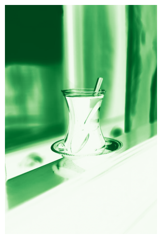
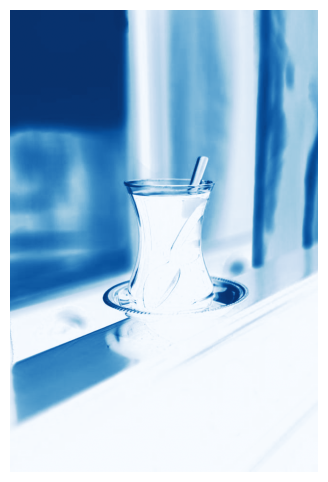
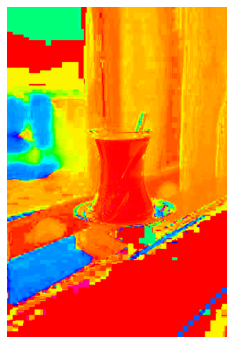
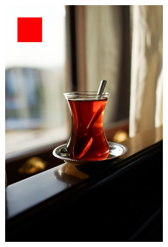
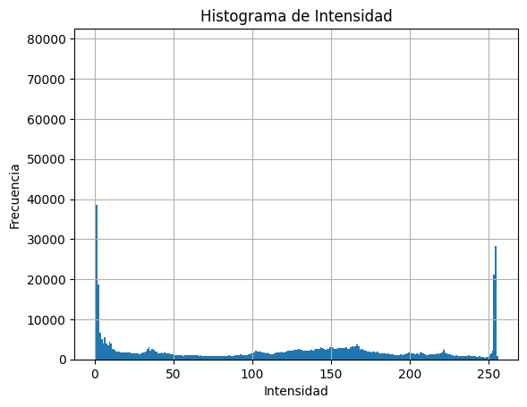
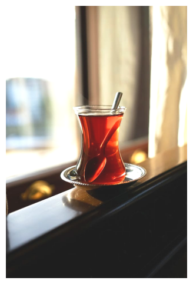

## 🧪 Taller - De Pixels a Coordenadas: Explorando la Imagen como Matriz
**📅 Fecha**

Fecha del taller

**🔍 Objetivo del taller**

Comprender cómo se representa una imagen digital como una matriz numérica y manipular sus componentes a nivel de píxel. Se abordará cómo trabajar con los valores de color y brillo directamente, accediendo a regiones específicas de la imagen para su análisis o modificación.

**🧠 Conceptos Aprendidos**

* ✅ Representación de imágenes como matrices NumPy.
* ✅ Acceso a valores de píxeles individuales y por canales de color (BGR, HSV).
* ✅ Manipulación de regiones de imagen mediante slicing de matrices.
* ✅ Sustitución de áreas de la imagen.
* ✅ Cálculo y visualización de histogramas de intensidad.
* ✅ Aplicación de ajustes básicos de brillo y contraste.
* ✅ Uso de OpenCV (`cv2`) y NumPy para manipulación de imágenes.
* ✅ Visualización de imágenes y gráficos con Matplotlib (`matplotlib.pyplot`).

**🔧 Herramientas y Entornos**

* Python (Jupyter Notebook o Google Colab)
* OpenCV (`opencv-python-headless`)
* NumPy
* Matplotlib

**📁 Estructura del Proyecto**

2025-05-02_taller_imagen_matriz_pixeles/<br>
├── datos/<br>
│   └── foto.jpg<br>
├── entorno/<br>
│   └── python.ipynb<br>
├── resultados/<br>
│   ├── ajuste.png<br>
│   ├── blue.png<br>
│   ├── gray 1.png<br>
│   ├── gray 2.png<br>
│   ├── green.png<br>
│   ├── histo.png<br>
│   ├── HSV.png<br>
│   ├── red.png<br>
│   ├── slicing 2.png<br>
│   └── slicing.png<br>
└── README.md

**🧪 Implementación**

🔹 Etapas realizadas

1.  Carga y validación de la imagen.
2.  Separación y visualización de canales de color (BGR y HSV).
3.  Modificación de regiones de la imagen mediante slicing.
4.  Copia y pegado de regiones de la imagen.
5.  Cálculo y visualización del histograma de intensidad (en escala de grises).
6.  Aplicación de ajustes de brillo y contraste.

---

**💻 Código Relevante**

Aquí se presentan los fragmentos clave del código Python que demuestran la manipulación de la imagen como una matriz de píxeles.

**1. Cargar la imagen**

```python
import cv2
import numpy as np
import matplotlib.pyplot as plt

# Función auxiliar para mostrar imágenes (útil en Colab/Jupyter)
def mostrar_img(img, cmap=None):
    plt.figure(figsize=(6, 6))
    if len(img.shape) == 3:
        img = cv2.cvtColor(img, cv2.COLOR_BGR2RGB)
    plt.imshow(img, cmap=cmap)
    plt.axis('off')
    plt.show()

# 📁 Cargar imagen (modifica esta ruta con tu imagen)
ruta_imagen = '../datos/foto.jpg'
img = cv2.imread(ruta_imagen)

# Validar carga y mostrar
if img is None:
    print("❌ No se pudo cargar la imagen. Verifica la ruta.")
else:z
    mostrar_img(img)
    print("✅ Imagen cargada correctamente")
Este fragmento carga una imagen en color usando OpenCV, que la representa internamente como una matriz NumPy tridimensional (altura x ancho x canales). La validación asegura que la carga fue exitosa, y la función mostrar_img la visualiza.

2. Modificar una región mediante Slicing

Python

# ✂️ Modificar región (slicing)
modificada = img.copy()
# Selecciona una región rectangular (filas 50 a 149, columnas 50 a 149)
# y le asigna el valor [0, 0, 255], que es rojo puro en formato BGR.
modificada[50:150, 50:150] = [0, 0, 255]
mostrar_img(modificada)
Demuestra la manipulación directa de una región de la matriz de imagen utilizando slicing de NumPy. Se accede a un rango de filas y columnas y se modifican los valores de píxel en esa área específica, ilustrando el acceso por coordenadas.

3. Ajustar brillo y contraste

Python

# 💡 Ajuste de brillo y contraste
alpha = 1.2  # Factor de contraste (>1 aumenta, <1 disminuye)
beta = 30    # Valor de brillo (positivo aumenta, negativo disminuye)

# Aplica la transformación lineal: output = alpha * input + beta
ajustada_manual = cv2.convertScaleAbs(img, alpha=alpha, beta=beta)
mostrar_img(ajustada_manual)
Ilustra cómo modificar los valores de intensidad de los píxeles en toda la matriz de imagen para ajustar el brillo y el contraste. cv2.convertScaleAbs realiza una operación matemática simple en cada píxel, mostrando la manipulación a nivel de valor.
```


🖼️ Resultados

Imagen original
<div align="center">  </div>
Canales de Color (BGR)
Rojo	Verde	Azul
		
Canales de Color (HSV) y Escala de Grises
HSV	Gris 1	Gris 2
		
Manipulación de Regiones
Slicing	Copiar/Pegar
	
Análisis y Ajustes
Histograma	Brillo/Contraste
	


🧩 Prompts Usados

"Carga una imagen a color en Python con OpenCV y muestra sus canales RGB y HSV."
"Modifica una región rectangular de una imagen usando slicing de NumPy."
"Calcula y visualiza el histograma de una imagen en escala de grises."
"Aplica ajustes de brillo y contraste a una imagen con OpenCV."
💬 Reflexión Final

Este taller proporcionó una comprensión fundamental de cómo las imágenes digitales son esencialmente matrices de números. Manipular píxeles y regiones directamente abre un abanico de posibilidades para procesar y transformar imágenes.

La capacidad de acceder y modificar valores de píxel por coordenada es muy potente para tareas específicas de edición o análisis local. Entender los diferentes espacios de color como BGR y HSV es crucial para trabajar con información cromática de manera efectiva.

La visualización del histograma fue una herramienta valiosa para entender la distribución de intensidad en la imagen, lo cual es útil para ajustar la exposición o preparar la imagen para otros procesamientos. Ajustar brillo y contraste directamente o con funciones dedicadas mostró cómo alterar la apariencia general de la imagen a nivel global.

La principal dificultad podría radicar en la gestión de coordenadas (fila vs columna, x vs y) y la diferencia en el orden de canales entre OpenCV (BGR) y otras herramientas (RGB), lo cual requiere atención para evitar errores de color.