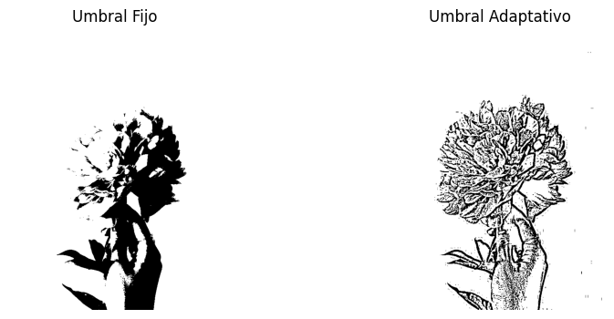
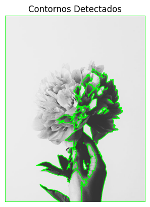
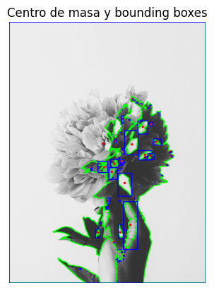

## 🧪 Segmentando el Mundo: Binarización y Reconocimiento de Formas
**📅 Fecha**

2025-05-02

**🎯 Objetivo del Taller**

Aplicar técnicas básicas de segmentación en imágenes mediante umbralización y detección de formas simples. El objetivo es comprender cómo identificar regiones de interés mediante procesos de binarización, análisis de contornos y extracción de características geométricas.

**🧠 Conceptos Aprendidos**

* ✅ Carga y visualización de imágenes en escala de grises con OpenCV.
* ✅ Aplicación de binarización por umbral fijo y umbral adaptativo.
* ✅ Detección de contornos con `cv2.findContours()` y representación gráfica.
* ✅ Cálculo del centro de masa mediante momentos (`cv2.moments()`).
* ✅ Dibujo de bounding boxes para formas detectadas.
* ✅ Obtención de métricas básicas como cantidad de formas, área y perímetro promedio.
* Bonus: Espacio para integración con webcam o secuencias de imágenes (en tiempo real).

**🔧 Herramientas y Entornos**

* Python (Jupyter Notebook o Google Colab)
* OpenCV (`opencv-python-headless`)
* NumPy
* Matplotlib

**📁 Estructura del Proyecto**

2025-05-02_taller_segmentacion_formas/ 
├── datos/ 
│   └── mano.jpg 
├── entorno/ 
│   └── python.ipynb 
├── resultados/ 
│   ├── centro_masa.png 
│   ├── contornos.png 
│   └── umbrales.png 
└── README.md

**🧪 Implementación**

🔹 Etapas realizadas

1.  Carga de la imagen en escala de grises.
2.  Aplicación de segmentación binaria (fijo y adaptativo).
3.  Extracción de contornos y dibujo sobre la imagen original.
4.  Cálculo del centro de masa y rectángulos envolventes.
5.  Obtención de estadísticas geométricas: número, área y perímetro promedio.

**🖼️ Resultados**

Imagen original:

Binarización por umbral fijo y adaptativo:

Contornos detectados:

Centro de masa + Bounding boxes:

**🧩 Prompts Usados**

* “Aplica segmentación de imágenes con OpenCV usando umbral fijo y adaptativo, encuentra contornos, calcula centros de masa y bounding boxes, y muestra métricas básicas como área y perímetro promedio.”
* “Prepara notebook en Colab con espacio para cargar la imagen desde ruta personalizada.”

**💬 Reflexión Final**

Este taller fue clave para entender cómo identificar regiones significativas en una imagen usando técnicas simples pero poderosas de visión por computador.

La binarización nos permitió destacar formas, y gracias a `cv2.findContours()` fue posible extraerlas y analizarlas geométricamente.

El uso de momentos para encontrar el centro de masa resultó muy útil, al igual que visualizar bounding boxes para tener una idea clara de la dimensión de cada forma.

Una dificultad inicial fue elegir un buen umbral y ajustar parámetros para obtener una segmentación efectiva, especialmente en imágenes con ruido o iluminación no uniforme.