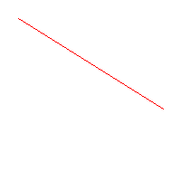
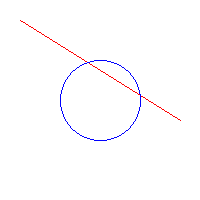
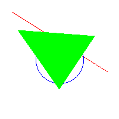

## 🧪 Taller - Rasterización desde Cero: Dibujando con Algoritmos Clásicos

**📅 Fecha**  
Fecha del taller

**🔍 Objetivo del taller**  
Comprender e implementar los algoritmos clásicos de rasterización para líneas, círculos y triángulos, entendiendo cómo se construyen imágenes píxel a píxel en una pantalla sin usar librerías de alto nivel.

**🧠 Conceptos Aprendidos**
* ✅ Algoritmo de Bresenham para líneas
* ✅ Algoritmo de punto medio para círculos
* ✅ Rasterización de triángulos por scanlines
* ✅ Manejo directo de buffers de píxeles
* ✅ Técnicas básicas de gráficos por computadora
* ✅ Uso de Pillow para creación de imágenes
* ✅ Visualización con Matplotlib

**🔧 Herramientas y Entornos**
* Python (Jupyter Notebook o Google Colab)
* Pillow (`PIL`)
* Matplotlib (`matplotlib.pyplot`)
* NumPy (opcional)

**📁 Estructura del Proyecto**

2025-05-03_taller_algoritmos_rasterizacion_basica/<br>
├── python/<br>
│ └── rasterizacion_algoritmos.ipynb<br>
├── resultados/<br>
│ ├── linea.png<br>
│ ├── circulo.png<br>
│ ├── triangulo.png<br>
└── README.md<br>


**🧪 Implementación**

🔹 Algoritmos implementados

1. **Algoritmo de Bresenham** para líneas eficientes
2. **Algoritmo de punto medio** para círculos simétricos
3. **Relleno de triángulos** mediante scanlines

---

**💻 Código Relevante**

**1. Configuración inicial**
```python
from PIL import Image, ImageDraw
import matplotlib.pyplot as plt

width, height = 200, 200
image = Image.new('RGB', (width, height), 'white')
pixels = image.load()
```
**2. Algoritmo de Bresenham (líneas)**
```python
def bresenham(x0, y0, x1, y1):
    dx = abs(x1 - x0)
    dy = abs(y1 - y0)
    sx = 1 if x0 < x1 else -1
    sy = 1 if y0 < y1 else -1
    err = dx - dy

    while True:
        if 0 <= x0 < width and 0 <= y0 < height:
            pixels[x0, y0] = (255, 0, 0)  # Rojo
        if x0 == x1 and y0 == y1:
            break
        e2 = 2 * err
        if e2 > -dy:
            err -= dy
            x0 += sx
        if e2 < dx:
            err += dx
            y0 += sy

bresenham(20, 20, 180, 120)
```

**3. Algoritmo de punto medio (círculos)**

```python
def midpoint_circle(x0, y0, radius):
    x = radius
    y = 0
    p = 1 - radius

    while x >= y:
        for dx, dy in [(x, y), (y, x), (-x, y), (-y, x), 
                      (-x, -y), (-y, -x), (x, -y), (y, -x)]:
            if 0 <= x0 + dx < width and 0 <= y0 + dy < height:
                pixels[x0 + dx, y0 + dy] = (0, 0, 255)  # Azul
        y += 1
        if p <= 0:
            p += 2*y + 1
        else:
            x -= 1
            p += 2*y - 2*x + 1

midpoint_circle(100, 100, 40)
```

**4. Relleno de triángulos**

```python
def fill_triangle(p1, p2, p3):
    pts = sorted([p1, p2, p3], key=lambda p: p[1])
    (x1, y1), (x2, y2), (x3, y3) = pts

    def interpolate(y0, y1, x0, x1):
        if y1 - y0 == 0: return []
        return [int(x0 + (x1 - x0) * (y - y0) / (y1 - y0)) for y in range(y0, y1)]

    x12 = interpolate(y1, y2, x1, x2)
    x23 = interpolate(y2, y3, x2, x3)
    x13 = interpolate(y1, y3, x1, x3)

    x_left = x12 + x23
    for y, xl, xr in zip(range(y1, y3), x13, x_left):
        for x in range(min(xl, xr), max(xl, xr)):
            if 0 <= x < width and 0 <= y < height:
                pixels[x, y] = (0, 255, 0)  # Verde

fill_triangle((30, 50), (100, 150), (160, 60))
```


🖼️ Resultados
Primitivas Generadas
Línea (Bresenham)	Círculo (Punto Medio)	Triángulo (Scanlines)
	




## 🧩 Prompts Usados

* "Implementa el algoritmo de Bresenham para dibujar líneas eficientemente en un buffer de píxeles"
* "Explica y codifica el algoritmo de punto medio para rasterizar círculos perfectos"
* "Cómo rellenar un triángulo usando el método de scanlines en Python con PIL"
* "Crea un notebook que muestre paso a paso la rasterización de primitivas gráficas básicas"
* "Compara visualmente los resultados de diferentes algoritmos de rasterización"


📚 Reflexión Final
Este taller permitió comprender los fundamentos de la rasterización a bajo nivel:

Bresenham vs Punto Medio: Ambos algoritmos son eficientes, pero mientras Bresenham optimiza el dibujo de líneas, el algoritmo de punto medio es ideal para formas curvas como círculos.

Relleno de triángulos: La técnica de scanlines demostró ser versátil para polígonos convexos, aunque requiere ordenamiento previo de vértices.

Precisión vs Rendimiento: Los algoritmos clásicos ofrecen un buen balance entre precisión y eficiencia computacional.

La principal dificultad radicó en manejar correctamente las condiciones de borde y las transiciones entre octantes en los algoritmos. La rasterización manual, aunque más laboriosa que usar librerías, proporciona un entendimiento profundo de cómo funcionan los gráficos por computadora a nivel fundamental.