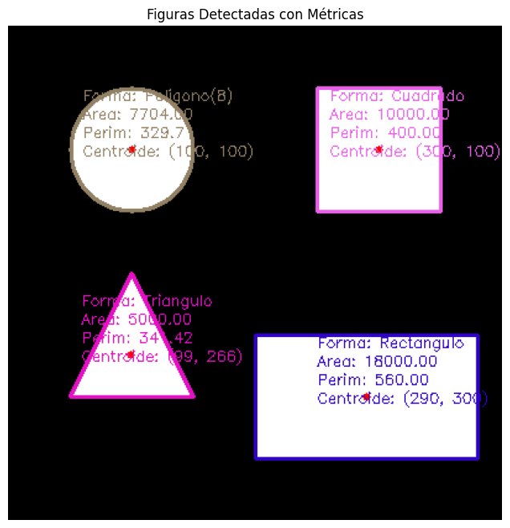

# 🧪 Taller - Análisis de Figuras Geométricas: Centroide, Área y Perímetro

📅 Fecha  
[Fecha del Taller,  2025-05-03] – Fecha de realización

---

🎯 Objetivo del Taller  
Detectar formas simples (círculos, cuadrados, triángulos) en imágenes binarizadas y calcular propiedades geométricas fundamentales como el área, el perímetro y el centroide para cada figura. El objetivo es desarrollar habilidades en el procesamiento de contornos utilizando OpenCV y la extracción de métricas cuantitativas de formas visuales.

---

🧠 Conceptos Aprendidos

✅ Detección de contornos de objetos en imágenes binarizadas (`cv2.findContours`).
✅ Cálculo del área de un contorno (`cv2.contourArea`).
✅ Cálculo del perímetro o longitud de arco de un contorno (`cv2.arcLength`).
✅ Utilización de momentos de imagen (`cv2.moments`) para encontrar propiedades como el centroide.
✅ Dibujo de contornos y puntos (centroides) sobre imágenes.
✅ Añadir texto a imágenes para etiquetar figuras con sus métricas.
✅ Clasificación básica de formas geométricas basada en la aproximación poligonal (`cv2.approxPolyDP`).

---

🔧 Herramientas y Entornos

- Python
- `opencv-python`
- `numpy`
- `matplotlib`

---

📁 Estructura del Proyecto

2025-05-03_taller_analisis_geometrico]/<br>
├── entorno/python/<br>
│   └── analisis_geometrico.ipynb  <br>
└── README.md


---

🧪 Implementación

🔹 Etapas realizadas

1.  Generación o carga de una imagen binarizada con figuras geométricas simples.
2.  Detección de los contornos de las figuras en la imagen binarizada.
3.  Iteración sobre cada contorno detectado.
4.  Cálculo del área y perímetro de cada contorno.
5.  Cálculo de los momentos y extracción de las coordenadas del centroide para cada contorno.
6.  Clasificación aproximada de cada figura (Triángulo, Cuadrado, Círculo, etc.) usando aproximación poligonal.
7.  Dibujo de cada contorno detectado y su centroide en una imagen de salida.
8.  Etiquetado de cada figura con su tipo, área, perímetro y coordenadas del centroide mediante texto sobre la imagen.
9.  Visualización de la imagen resultante con todas las figuras detectadas y etiquetadas.

---

### 📊 Análisis de Contornos y Propiedades

**Descripción:**  
El núcleo del taller reside en el procesamiento de los contornos detectados. Por cada contorno, se extraen propiedades cuantitativas (área, perímetro, centroide) y se realiza una clasificación heurística basada en el número de vértices de una aproximación poligonal. Los resultados se visualizan directamente sobre la imagen, permitiendo una verificación visual de la detección y los cálculos.

**Código relevante:**

```python
# Detectar contornos
contours, _ = cv2.findContours(binary_image, cv2.RETR_EXTERNAL, cv2.CHAIN_APPROX_SIMPLE)

for i, contour in enumerate(contours):
    # Calcular Propiedades
    area = cv2.contourArea(contour)
    perimeter = cv2.arcLength(contour, True)
    M = cv2.moments(contour)

    # Calcular Centroide
    cX, cY = 0, 0
    if M["m00"] != 0:
        cX = int(M["m10"] / M["m00"])
        cY = int(M["m01"] / M["m00"])

    # Clasificación (Bonus)
    epsilon = 0.04 * perimeter
    approx = cv2.approxPolyDP(contour, epsilon, True)
    num_vertices = len(approx)
    shape_type = "Desconocido"
    if num_vertices == 3: shape_type = "Triangulo"
    elif num_vertices == 4: shape_type = "Cuadrado" # O Rectangulo, con más checks
    elif num_vertices > 8: shape_type = "Circulo" # Heurística simple

    # Dibujar contorno y centroide
    cv2.drawContours(output_image, [contour], -1, color, 2)
    cv2.circle(output_image, (cX, cY), 3, (0, 0, 255), -1)

    # Etiquetar
    label = f"Area: {area:.2f}, Perim: {perimeter:.2f}, C:({cX},{cY})"
    shape_label = f"Forma: {shape_type}"
    cv2.putText(output_image, shape_label, (cX - 40, cY - 40), cv2.FONT_HERSHEY_SIMPLEX, 0.4, color, 1)
    cv2.putText(output_image, label, (cX - 40, cY - 25), cv2.FONT_HERSHEY_SIMPLEX, 0.4, color, 1)

```
**Imagen Binarizada Generada**


**Imagen con contornor y metricas**




🖼️ Visualización de Resultados
Descripción:  
La imagen de salida muestra la imagen binarizada original con los contornos de las figuras detectadas dibujados en diferentes colores. Cada figura está etiquetada con su clasificación (si fue posible), su área, perímetro y las coordenadas de su centroide, que también se marcan con un punto rojo.

(Nota: El resultado visual es una imagen estática generada por matplotlib.pyplot.show() dentro del notebook, no un GIF interactivo).

🧩 Prompts Usados

"Genera una imagen en blanco con un círculo, cuadrado y triángulo usando OpenCV en Python."
"Encuentra los contornos de las figuras en una imagen binarizada usando cv2.findContours."
"Para cada contorno, calcula su área con cv2.contourArea y su perímetro con cv2.arcLength."
"Calcula los momentos de un contorno usando cv2.moments y determina las coordenadas del centroide."
"Dibuja los contornos detectados y los centroides sobre una imagen."
"Añade texto a la imagen para etiquetar cada figura con su área, perímetro y coordenadas del centroide."
"Usa cv2.approxPolyDP para clasificar un contorno como triángulo, cuadrado o círculo basado en el número de vértices."
"Muestra la imagen final con los contornos y las etiquetas usando matplotlib."

💬 Reflexión Final

Este taller proporcionó una experiencia práctica en la extracción de información cuantitativa a partir de formas visuales. El proceso de pasar de una imagen binarizada a la identificación de figuras y el cálculo de sus propiedades ilustra bien el poder del procesamiento de contornos en visión artificial. Entender cómo los momentos permiten calcular el centroide fue un punto clave. La clasificación básica usando la aproximación poligonal mostró una forma sencilla de reconocer formas por su estructura fundamental, aunque se hizo evidente que la clasificación robusta de formas requiere lógicas más sofisticadas (por ejemplo, considerando relaciones de aspecto, compacidad, etc.). La visualización de los resultados directamente sobre la imagen fue crucial para verificar la precisión de la detección y los cálculos. Este es un paso fundamental para tareas más avanzadas que implican la medición y el análisis de objetos en imágenes.